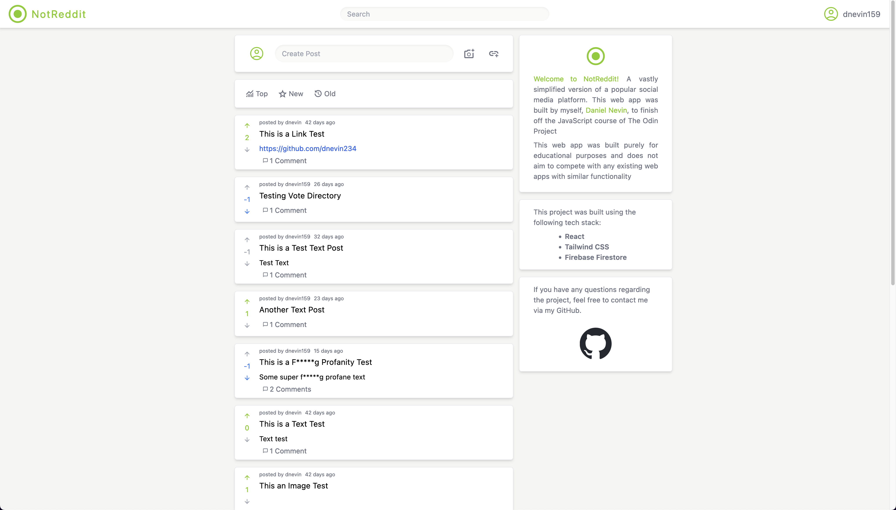

# This is NotReddit

NotReddit is my shot at building a "Reddit-Like" social media platform as a submission for The Odin Project's final JavaScript Project.

The project was built using React, TailwindCSS, and Firebase.

## Functionality

- Users can sign up to NotReddit by using an email and choosing a display name.

- Once signed up, Users can login and post their content; whether it be Text, an Image, or a Direct Link to somewhere else.

- NotReddit uses a f*****g Profanity Filter so profane language will be hidden behind a wall of asterix (the first and final characters will remain so you can get your point across).

- Once posted, Users can edit the text of their post and if they desire, can also delete the post from the Firestore completely.

If you want to have a look just press the github-pages button to the right of this README. While you're there feel free to sign up and have a play around.

**Disclaimer: NotReddit does not aim to compete against Reddit in any form and was only built for educational purposes**

